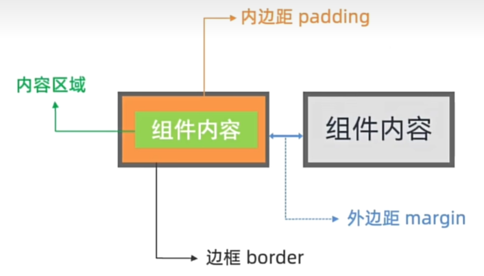
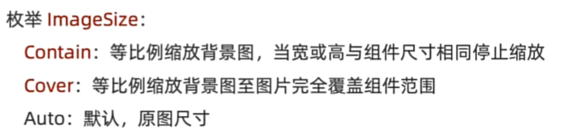
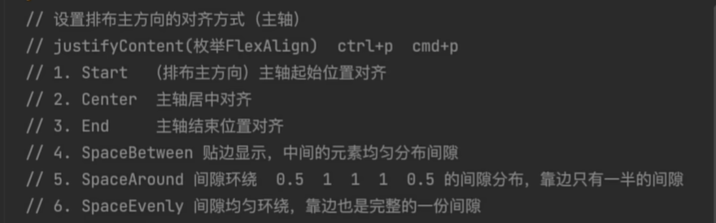

# 布局

思路：先排版，再内容

组件属性方法，文本颜色，文本行高，文本溢出省略号

```ts
Text('吕布吕布吕布吕布吕布吕布吕布吕布吕布')
  .fontSize(30)
  .fontWeight(FontWeight.Bold)
  .textOverflow({
    overflow: TextOverflow.Ellipsis
  })
  .maxLines(1)
  .fontColor(Color.Red)
  .lineHeight(50)
```

图片组件

```ts
Image($r('app.media.popular'))
  .width(200)

Image('https://s1.hdslb.com/bfs/static/jinkela/popular/assets/icon_popular.png')
  .width(100)
```

输入框和按钮

```ts
组件间隙
Column({ space: 10 })

TextInput({
  placeholder: '请输入'
})
  .placeholderColor(Color.Gray)
  .height(50)
  .type(InputType.Password)

Button('按钮')
  .type(ButtonType.Capsule)
```

svg矢量图标

```
https://developer.huawei.com/consumer/cn/design/harmonyos-icon/
```

布局元素的组成和内边距，外边距



边框

```tsx
Text('大王叫我来巡山')
  .fontSize(20)
  .fontWeight(FontWeight.Bolder)
  .padding(10)
  .border({
    width: {
      left:1,
      right:5,
      top:3,
      bottom:2
    } ,
    color:{
      left:Color.Red,
      right:Color.Blue,
      top:Color.Pink,
      bottom:Color.Green
    },
    style:{
      left:BorderStyle.Solid,
      right:BorderStyle.Dotted,
      bottom:BorderStyle.Dotted,
      top:BorderStyle.Dashed
    }
  })
```

组件圆角

```ts
Text('大王叫我来巡山')
  .fontSize(20)
  .fontWeight(FontWeight.Bolder)
  .padding(10)
  .backgroundColor(Color.Orange)
  .borderRadius({
    topLeft:20,
    topRight:20,
    bottomLeft:20,
    bottomRight:20
  })
```

背景图

```ts
Text('内容')
  .width(300)
  .height(100)
  .backgroundImage($r('app.media.popular'), ImageRepeat.XY)

// 背景图平铺
Text('内容')
  .width(300)
  .height(100)
  .border({
    width:1
  })
.backgroundImage($r('app.media.popular'),ImageRepeat.XY)

// 背景图居中
Text('内容')
  .width(300)
  .height(100)
  .border({
    width:1
  })
  .backgroundImage($r('app.media.popular') )
  .backgroundImagePosition(Alignment.Center)
```

背景定位默认单位 -> px ：实际的物理像素点，设备出厂，就定好了【分辨率单位】

宽高默认单位 -> vp : 虚拟像素，相对于不同的设备会自动转换，保证不同设备视觉一致

函数 ： vp2px(数值) 将vp进行转换，得到px的数值

```ts
Text('内容')
  .width(300)
  .height(100)
  .border({
    width: 1
  })
  .backgroundImage($r('app.media.popular'))
  .backgroundImagePosition({
    x: vp2px(150),
    y: vp2px(50)
  })
```

背景图尺寸



```tsx
Text()
  .width(300)
  .height(200)
  .border({
    width:1
  })
  .backgroundImage($r('app.media.bannerpc12'))
  .backgroundImagePosition(Alignment.Center)
  .backgroundImageSize(ImageSize.Contain)
```

线性布局 - 主轴对齐方式

```ts
.justifyContent(枚举FlexAlign)
```



线性布局 - 交叉轴对齐方式

```ts
// 水平
.alignItems(枚举HorizontalAlign)
// 垂直
.alignItems(枚举Vertica)
```

自适应伸缩

按照份数权重，分配剩余空间`

```ts
.layoutWeight(数字)
```

填充空白区域，自适应

```ts
Blank()
```

Text内有多种字体样式

```ts
Text() {
  Span('我已经阅读并同意')
  Span('《京东隐私政策》')
    .fontColor('#3274f6').fontSize(12)
  Span('《京东用户服务协议》')
    .fontColor('#3274f6').fontSize(12)
  Span('未注册的手机号将自动创建京东账号')
}
```

复选框

```ts
Checkbox()
  .width(10)
```

弹性布局（Flex）

```ts
Flex(参数对象){
    子组件1
    子组件2
    子组件3
    子组件N
}

参数：
主轴方向：direction
主轴对齐方式：justifyContent
交叉轴对齐方式：alignItems
布局换行：wrap
```

绝对定位 - position

参照 父组件左上角 进行偏移

绝对定位后的组件不再占用自身原有位置

```ts
.position(位置对象)
参数{x: 水平偏移量 , y: 垂直偏移量}
```

不动结构的情况下调整组件的层级

```ts
.zIndex(数字)
```

层叠布局

```ts
Stack({
    alignContent: Alignment.Center
}){
    Item1()
    Item2()
    Item3()
}
```

